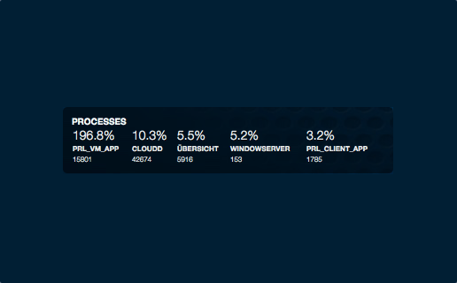

# Process Bar

I took Coby Chapple's nice [Memory Bar Widget](https://github.com/cobyism/ubersicht-memory-bar) and made a matching widget that shows the top 5 processes.

## What the Widget Shows

The information displayed for each process is as follows:

- CPU Utilization (%cpu)
- Process Name (ucomm)
- Process Id (pid)

## A Note on Percentages 

Wondering why you occasionally see processes with CPU utilization greater than 100 percent? The answer is pretty straight-forward. If you have a multi-core CPU then each one of those cores can account for up to 100%. If each core is capable of supporting multiple threads, each thread can account for 100%. For example, my mid-2014 Macbook Pro has a 2.5 GHz Intel Core i7 with 4 cores. Each if those cores can use two threads thanks to Hyper-Threading. That means that its full CPU capacity is actually 800%.
